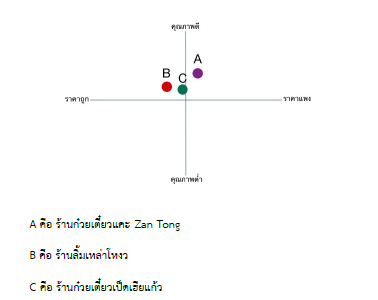

# Feasibility Study of Opening Zan Tong Hakka Noodle at Vi Plaza


---

## วัตถุประสงค์

ศึกษาความเป็นไปได้ในการเปิดร้านก๋วยเตี๋ยวแคะ Zan Tong ในห้าง Vi Plaza ใน 4 มิติ ได้แก่

1. ด้านการตลาด
2. ด้านเทคนิค
3. ด้านการบริหารจัดการ
4. ด้านการเงิน

---

## 🔬 วิธีการดำเนินงาน

```

เริ่มต้น
    │
    ▼
กำหนดวัตถุประสงค์และเป้าหมาย
    │
    ▼
ศึกษาและวิเคราะห์ข้อมูลด้านการตลาด
 - เก็บข้อมูลจากแบบสอบถาม 96 ชุด
 - วิเคราะห์ SWOT / BMC / STP
    │
    ▼
ศึกษาและวิเคราะห์ข้อมูลด้านเทคนิคและบริหารจัดการ
 - ออกแบบสถานที่ตั้ง แผนผัง อุปกรณ์ บุคลากร
    │
    ▼
ศึกษาและวิเคราะห์ข้อมูลด้านการเงิน
 - คำนวณ NPV / IRR / WACC / Payback Period
    │
    ▼
สรุปผล
```

---

##  1 — ด้านการตลาด (Market Study)

### 1.1 ข้อมูลประชากร

โรงพยาบาลวิภาวดีเป็นโรงพยาบาลที่มีความพร้อมในการให้บริการทางการแพทย์ครอบคลุมหลากหลายสาขา โดยมี:

| รายการ | จำนวน |
|---|---|
| เตียงรองรับผู้ป่วย | 258 เตียง |
| ห้องตรวจ | มากกว่า 200 ห้อง |
| ผู้ใช้บริการต่อวัน | ~2,000 คน |
| แพทย์ประจำ | มากกว่า 95 คน |
| แพทย์ที่ปรึกษา | มากกว่า 350 คน |

ประชากรที่ใช้บริการใน Vi Plaza ประมาณได้ **2,445 คน/วัน**

### 1.2 ผลการสำรวจแบบสอบถาม

ใช้สูตร Taro Yamane ที่ความคลาดเคลื่อน 10% คำนวณได้กลุ่มตัวอย่าง **96 ชุด**

**อายุของผู้ตอบแบบสอบถาม**

| ช่วงอายุ | จำนวน (คน) | ร้อยละ |
|---|---|---|
| 20–30 ปี | 49 | 51.0% |
| 31–40 ปี | 29 | 30.2% |
| 41–50 ปี | 10 | 10.4% |
| 51–60 ปี | 5 | 5.2% |
| 60 ปีขึ้นไป | 3 | 3.1% |

**สถานะทางการแพทย์**

| สถานะ | จำนวน (คน) | ร้อยละ |
|---|---|---|
| เจ้าหน้าที่โรงพยาบาล | 39 | 41.1% |
| ผู้มาเยี่ยม | 33 | 34.7% |
| ประชาชนทั่วไป | 16 | 16.8% |
| ผู้ป่วย | 7 | 7.4% |

**ความรู้จักและความสนใจก๋วยเตี๋ยวแคะ**

| รายการ | ใช่ | ไม่ใช่ |
|---|---|---|
| รู้จักก๋วยเตี๋ยวแคะ | 73.7% | 26.3% |
| สนใจรับประทานก๋วยเตี๋ยวแคะ | **93.8%** | 6.3% |

**ช่วงราคาที่ยอมจ่ายต่อมื้อ**

| ช่วงราคา | จำนวน (คน) | ร้อยละ |
|---|---|---|
| 50–100 บาท | 58 | **60.4%** |
| 101–150 บาท | 29 | 30.2% |
| 151–200 บาท | 7 | 7.3% |
| มากกว่า 200 บาท | 2 | 2.1% |

### 1.3 ปัจจัยที่ส่งผลต่อการเลือกใช้บริการร้านอาหาร (10 อันดับแรก)

| อันดับ | ปัจจัย | ค่าเฉลี่ย (จาก 5) |
|---|---|---|
| 1 | คุณภาพของอาหาร | 4.56 |
| 2 | รสชาติของอาหาร | 4.55 |
| 3 | ความสะอาดปลอดภัย | 4.54 |
| 4 | ราคาและความคุ้มค่า | 4.48 |
| 5 | การบริการของพนักงาน | 3.95 |
| 6 | โต๊ะและที่นั่งมีจำนวนเพียงพอ | 3.95 |
| 7 | ความเร็วในการบริการ | 3.77 |
| 8 | ความสะดวกในการสั่ง | 3.69 |
| 9 | ความเป็นระเบียบของร้าน | 3.64 |
| 10 | บรรยากาศของร้าน | 3.57 |

### 1.4 การวิเคราะห์อุปสงค์

| ตัวแปร | ค่า | คำอธิบาย |
|---|---|---|
| จำนวนผู้ใช้บริการโรงพยาบาลต่อวัน | 2,445 คน | รวมบุคลากรแพทย์และผู้ใช้บริการ |
| สัดส่วนผู้สนใจซื้อก๋วยเตี๋ยวแคะ | 93.8% | จากแบบสอบถาม |
| สัดส่วนการซื้อจริงต่อวัน | 10% | สมมติว่า 10% จะมากินจริง |
| **อุปสงค์ต่อวัน** | **230 คน** | 2,445 × 0.938 × 0.1 |
| **อุปสงค์ต่อเดือน** | **6,900 คน** | 230 × 30 |

### 1.5 SWOT Analysis

| | **บวก** | **ลบ** |
|---|---|---|
| **ปัจจัยภายใน** | **Strengths** ✅ ก๋วยเตี๋ยวหากินได้ยากและมีเอกลักษณ์เฉพาะตัว / ทำเลติดถนนวิภาวดีซึ่งมีการสัญจรสูง / เมนูหลากหลายรวมถึงของทานเล่น | **Weaknesses** ❌ แบรนด์ไม่เป็นที่รู้จักมากนัก |
| **ปัจจัยภายนอก** | **Opportunities** ✅ ขยายสาขาไปในโรงพยาบาลที่อยู่ในเครือ / ขยายไปสู่กลุ่มผู้ป่วยหรือผู้มาเยี่ยมที่พักค้างคืน | **Threats** ❌ การแข่งขันจากร้านอาหารในพื้นที่ใกล้เคียง |

### 1.6 Business Model Canvas (BMC)

| หัวข้อ | รายละเอียด |
|---|---|
| **กลุ่มลูกค้า** | ผู้ป่วย / ผู้มาเยี่ยม / บุคลากรทางการแพทย์ / ประชาชนทั่วไป |
| **จุดเด่นของสินค้า** | รสชาติอาหารอร่อยและมีคุณภาพ / เอกลักษณ์เฉพาะตัว / ความสะอาดปลอดภัย / ราคาและความคุ้มค่า |
| **ช่องทางการสื่อสาร** | หน้าร้าน / แพลตฟอร์มออนไลน์เดลิเวอรี่ / Facebook, Instagram |
| **ความสัมพันธ์กับลูกค้า** | บริการรวดเร็ว / จดจำเมนูที่ลูกค้าชอบ / โปรแกรมสะสมแต้ม / โปรโมชั่นพิเศษ |
| **กลยุทธ์การเงิน** | รายได้จากการขายอาหารและเครื่องดื่ม |
| **ทรัพยากรหลัก** | ที่เช่า / พนักงาน / อุปกรณ์และเฟอร์นิเจอร์ / วัตถุดิบ |
| **กิจกรรมหลัก** | ขายอาหาร / บริการลูกค้า |
| **พาร์ทเนอร์** | ซัพพลายเออร์วัตถุดิบ / โรงพยาบาล / บริษัทจัดส่ง |
| **โครงสร้างต้นทุน** | ค่าลงทุน / ค่าจ้างพนักงาน / ค่าน้ำค่าไฟ / ค่าวัตถุดิบ |

### 1.7 STP Marketing Model

**Segmentation — การแบ่งกลุ่มตลาด**

| ประเภท | รายละเอียด |
|---|---|
| **Demographic** | อายุ 20–40 ปี / บุคลากรทางการแพทย์ ผู้ป่วย ผู้มาเยี่ยม ประชาชนทั่วไป |
| **Behavioral** | 73.7% รู้จักก๋วยเตี๋ยวแคะ / 93.8% สนใจรับประทาน / ส่วนใหญ่สนใจราคา 50–100 บาท (60.4%) |
| **Geographic** | Vi Plaza ใกล้โรงพยาบาลวิภาวดี — ลูกค้าหลักคือคนที่มาใช้บริการโรงพยาบาล |
| **Psychographic** | บุคคลที่ใช้ชีวิตเร่งรีบ ต้องการอาหารที่รวดเร็วและมีคุณภาพ |

**Targeting — กลุ่มเป้าหมาย**
- **กลุ่มหลัก:** บุคลากรทางการแพทย์และผู้มาเยี่ยมผู้ป่วย
- **กลุ่มรอง:** ประชาชนทั่วไป

**Positioning — การวางตำแหน่งและวิเคราะห์คู่แข่ง**

| ร้าน | เมนูและราคา | จุดแข็ง | จุดอ่อน |
|---|---|---|---|
| **Zan Tong (A)** | ก๋วยเตี๋ยวแคะ / ราคาปานกลาง-สูง | เมนูเฉพาะตัว / คุณภาพสูง | แบรนด์ยังไม่เป็นที่รู้จัก |
| ลิ้มเหล่าโหงว (B) | ก๋วยเตี๋ยวน้ำใส 55–65 บาท / เกาเหลา 65 บาท | มีชื่อเสียง / ฐานลูกค้าเดิม | เมนูน้อย / ไม่พัฒนาเมนูใหม่ |
| ก๋วยเตี๋ยวเป็ดเฒี่ยแก้ว (C) | ก๋วยเตี๋ยวเป็ดตุ๋น 70–80 บาท | รสชาติเป็นเอกลักษณ์ / สูตรลับ | มีเนื้อสัตว์ให้เลือกเพียงอย่างเดียว |




> **ตำแหน่งของ Zan Tong:** อยู่ในจตุภาคคุณภาพสูง — ราคาปานกลาง ซึ่งโดดเด่นกว่าคู่แข่งทั้งสองร้าน

---

## 2 — ด้านเทคนิคและบริหารจัดการ

### 2.1 สถานที่ตั้ง

ตั้งที่ **Vi Plaza ชั้น 1** ซึ่งเชื่อมต่อกับโรงพยาบาลวิภาวดี โดยมีจำนวนผู้เข้ารับบริการถึง **2,000 คน/วัน** และจากแบบสอบถาม 96 ชุด พบว่า **93.8%** สนใจที่จะกินก๋วยเตี๋ยวแคะ

### 2.2 เครื่องจักรและอุปกรณ์

| รายการ | จำนวน | ราคาต่อหน่วย (บาท) | ราคารวม (บาท) |
|---|---|---|---|
| หม้อก๋วยเตี๋ยว | 1 | 2,600 | 2,600 |
| ถังน้ำแข็ง | 1 | 10,900 | 10,900 |
| หม้อทอด | 1 | 1,700 | 1,700 |
| ที่ใส่เครื่องปรุง | 7 | 240 | 1,680 |
| เตาลวกก๋วยเตี๋ยว | 1 | 48,000 | 48,000 |
| โต๊ะสแตนเลส | 1 | 6,000 | 6,000 |
| เคาน์เตอร์ตู้เย็น | 1 | 42,000 | 42,000 |
| โต๊ะขนาด 60×60 | 5 | 4,000 | 20,000 |
| โต๊ะขนาด 110×60 | 2 | 6,000 | 12,000 |
| เก้าอี้ | 13 | 1,500 | 19,500 |
| ป้ายไฟหน้าร้าน | 1 | 28,000 | 28,000 |
| เครื่อง POS | 1 | 22,000 | 22,000 |
| ชุดเครื่องล้างจาน | 1 | 5,500 | 5,500 |
| **รวม** | | | **219,880** |

### 2.3 บุคลากร

| ตำแหน่ง | จำนวน | คุณสมบัติ | เงินเดือน/คน (บาท) | รวม (บาท/เดือน) |
|---|---|---|---|---|
| พนักงานในครัว | 2 | วุฒิ ม.6 ขึ้นไป | 15,000 | 30,000 |
| พนักงานบริการลูกค้า | 2 | วุฒิ ม.6 ขึ้นไป | 12,000 | 24,000 |
| **รวม** | **4** | | | **54,000** |

### 2.4 การเก็บรักษาวัตถุดิบ

**การควบคุมอุณหภูมิ:**
- ของสด: เก็บในตู้เย็นที่ 0–4°C หรือแช่แข็งต่ำกว่า 0°C
- ของแห้ง: เก็บในที่แห้งและเย็น อุณหภูมิ 15–25°C

**การเลือกบรรจุภัณฑ์:**
- ของสด: ถุงสุญญากาศหรือภาชนะปิดสนิท
- ของแห้ง: ขวดแก้วหรือพลาสติกปิดสนิท

**วิธีการใช้วัตถุดิบ:** ใช้ระบบ **FIFO (First In, First Out)** โดยมีการติดฉลากระบุวันที่รับเข้า เพื่อลดปัญหาวัตถุดิบเสื่อมคุณภาพ

---

## 3 — ด้านการเงิน (Financial Study)

### 3.1 ต้นทุนสินค้าที่จำหน่าย

**ต้นทุนวัตถุดิบต่อจาน**

| วัตถุดิบ | ปริมาณต่อจาน | ราคา | ต้นทุนต่อจาน (บาท) |
|---|---|---|---|
| เส้นก๋วยเตี๋ยว | 100 กรัม | 40 บาท/กก. | 4.00 |
| ลูกชิ้นแคะ | 50 กรัม | 180 บาท/กก. | 9.00 |
| น้ำซุป | 200 มล. | 10 บาท/ลิตร | 2.00 |
| เครื่องปรุงรส | 10 กรัม | 120 บาท/กก. | 1.20 |
| ผักสด | 30 กรัม | 50 บาท/กก. | 1.50 |
| กระเทียมเจียว | 5 กรัม | 200 บาท/กก. | 1.00 |
| **รวมต้นทุนวัตถุดิบ** | | | **18.70** |

**ต้นทุนรวมต่อจาน**

| ประเภทต้นทุน | ต้นทุนต่อจาน (บาท) |
|---|---|
| ต้นทุนวัตถุดิบ | 18.70 |
| ค่าแรงพนักงาน | 4.50 |
| ค่าใช้จ่ายคงที่ (ค่าเช่า + ค่าน้ำไฟ + จิปาถะ) | 6.22 |
| **รวมต้นทุนต่อจาน** | **29.42** |

### 3.2 เงินลงทุนรวม

| หมวดหมู่ | ค่าใช้จ่ายรวม (บาท) |
|---|---|
| ค่าใช้จ่ายลงทุนในทรัพย์สินถาวร | 219,880 |
| ค่าใช้จ่ายก่อนการดำเนินงาน | 638,000 |
| เงินทุนหมุนเวียน | 64,000 |
| **รวมเงินลงทุนทั้งหมด** | **921,880** |

**รายละเอียดค่าใช้จ่ายก่อนการดำเนินงาน**

| รายการ | ค่าใช้จ่าย (บาท) |
|---|---|
| ค่ารีโนเวทร้าน | 600,000 |
| ค่าเช่าสถานที่ก่อนเปิดร้าน | 33,000 |
| ค่าจดทะเบียนและใบอนุญาต | 5,000 |
| **รวม** | **638,000** |

**รายละเอียดเงินทุนหมุนเวียน**

| รายการ | ค่าใช้จ่าย (บาท) |
|---|---|
| ค่าจ้างพนักงานรายเดือน | 54,000 |
| ค่าน้ำค่าไฟรายเดือน | 5,000 |
| ค่าใช้จ่ายจิปาถะรายเดือน | 5,000 |
| **รวม** | **64,000** |

### 3.3 แหล่งที่มาและการใช้เงินทุน

**แหล่งที่มาของเงินทุน**

| แหล่งเงินทุน | จำนวน (บาท) | สัดส่วน |
|---|---|---|
| เงินลงทุนส่วนตัว | 621,880 | 67.5% |
| เงินกู้จากธนาคาร | 300,000 | 32.5% |
| **รวม** | **921,880** | **100%** |

**การใช้เงินทุน**

| รายการ | จำนวน (บาท) | สัดส่วน |
|---|---|---|
| ค่ารีโนเวทร้าน | 600,000 | 65.1% |
| ค่าซื้ออุปกรณ์ | 219,880 | 23.9% |
| เงินทุนหมุนเวียน | 64,000 | 6.9% |
| ค่าเช่าสถานที่ | 33,000 | 3.6% |
| ค่าใบอนุญาตธุรกิจ | 5,000 | 0.5% |
| **รวม** | **921,880** | **100%** |

### 3.4 ภาระดอกเบี้ยเงินกู้

| รายการ | รายละเอียด |
|---|---|
| เงินกู้ | 300,000 บาท |
| อัตราดอกเบี้ย | 8% ต่อปี |
| ระยะเวลากู้ | 3 ปี |
| ค่างวดรายเดือน | 9,400 บาท |
| ดอกเบี้ยรวม 3 ปี | 37,440 บาท |

### 3.5 ต้นทุนถัวเฉลี่ยของเงินทุน (WACC)

| แหล่งเงินทุน | จำนวน (บาท) | สัดส่วน | ต้นทุน |
|---|---|---|---|
| ส่วนของผู้ถือหุ้น | 621,880 | 67.5% | 12% |
| เงินกู้ | 300,000 | 32.5% | 8% |
| **WACC** | | | **10.18%** |

### 3.6 การวิเคราะห์มูลค่าปัจจุบันสุทธิ (NPV)

ใช้อัตราคิดลด = WACC = **10.18%** และกระแสเงินสด = **350,000 บาท/ปี** เป็นเวลา 5 ปี

| ปีที่ | กระแสเงินสด (บาท) | มูลค่าปัจจุบัน (บาท) |
|---|---|---|
| 0 | -921,880 | -921,000.00 |
| 1 | 350,000 | 317,099.89 |
| 2 | 350,000 | 287,756.59 |
| 3 | 350,000 | 261,441.67 |
| 4 | 350,000 | 237,772.88 |
| 5 | 350,000 | 216,360.57 |
| **NPV รวม** | | **398,816.80** |

> **NPV = 398,816.80 บาท (มากกว่า 0) → โครงการคุ้มค่า ✅**

### 3.7 การวิเคราะห์อัตราผลตอบแทนภายใน (IRR)

| ปีที่ | กระแสเงินสด (บาท) | มูลค่าปัจจุบันที่ IRR (บาท) |
|---|---|---|
| 0 | -921,880 | -921,880.00 |
| 1 | 350,000 | 277,768.91 |
| 2 | 350,000 | 220,367.88 |
| 3 | 350,000 | 174,829.97 |
| 4 | 350,000 | 138,832.59 |
| 5 | 350,000 | 110,193.63 |
| **IRR** | | **26.02%** |

> **IRR = 26.02% > WACC = 10.18% → โครงการให้ผลตอบแทนที่น่าพอใจ ✅**

### 3.8 ระยะเวลาคืนทุน (Payback Period)

| ปีที่ | กระแสเงินสด (บาท) | กระแสเงินสดสะสม (บาท) |
|---|---|---|
| 1 | 350,000 | 350,000 |
| 2 | 350,000 | 700,000 |
| **2.63** | | **≈ 921,880 (คืนทุน)** |
| 3 | 350,000 | 1,050,000 |
| 4 | 350,000 | 1,400,000 |
| 5 | 350,000 | 1,750,000 |

> **คืนทุนภายใน 2.63 ปี ✅**

### 3.9 การวิเคราะห์ความเสี่ยง (Sensitivity Analysis)

| สถานการณ์ | NPV (บาท) | ระยะคืนทุน (ปี) | ลูกค้าต่อวัน (คน) |
|---|---|---|---|
| ปกติ | 398,816.80 | 2.63 | 230 |
| รายได้เพิ่มขึ้น 10% | 530,886.48 | 2.39 | 253 |
| รายได้ลดลง 10% | 266,747.12 | 2.93 | 207 |
| ต้นทุนเพิ่มขึ้น 10% | 278,753.45 | 2.90 | 230 |
| ต้นทุนลดลง 10% | 545,560.89 | 2.37 | 230 |

> แม้ในสถานการณ์เลวร้ายที่สุด NPV ยังคงเป็นบวกและระยะคืนทุนไม่เกิน 3 ปี แสดงให้เห็นว่าโครงการมีความทนทานต่อความเสี่ยงในระดับดี

---

## ✅ สรุปผล

### ด้านการตลาด
กลุ่มเป้าหมายหลักได้แก่ บุคลากรทางการแพทย์ ผู้ป่วย และผู้มาเยี่ยม ซึ่งมีจำนวนมากและมีแนวโน้มในการใช้บริการร้านอาหารในพื้นที่ ผลสำรวจระบุว่า 93.8% สนใจรับประทานก๋วยเตี๋ยวแคะ และช่วงราคาที่ยินดีจ่ายส่วนใหญ่อยู่ที่ 50–100 บาทต่อมื้อ ร้านใช้กลยุทธ์ STP Marketing ในการกำหนดกลุ่มเป้าหมายและวางตำแหน่งแบรนด์ โดยชูจุดเด่นด้านรสชาติ คุณภาพ ความสะอาด และความเป็นเอกลักษณ์ของเมนู

### ด้านเทคนิคและบริหารจัดการ
ทำเลมีศักยภาพสูงเนื่องจากตั้งอยู่ในพื้นที่ที่มีการสัญจรของบุคลากรทางการแพทย์และผู้ใช้บริการโรงพยาบาลจำนวนมาก ร้านมีการออกแบบพื้นที่ให้เหมาะสม มีบุคลากรรวม 4 คน ระบบจัดเก็บวัตถุดิบแบบ FIFO และใช้เทคโนโลยี POS System เพื่อเพิ่มประสิทธิภาพการขาย

### ด้านการเงิน
เงินลงทุนรวม **921,880 บาท** มาจากเงินลงทุนส่วนตัว 67.5% และเงินกู้ธนาคาร 32.5%

| ตัวชี้วัด | ค่าที่ได้ | เกณฑ์ | ผล |
|---|---|---|---|
| NPV | 398,816.80 บาท | > 0 | ✅ ผ่าน |
| IRR | 26.02% | > WACC (10.18%) | ✅ ผ่าน |
| Payback Period | 2.63 ปี | — | ✅ สมเหตุสมผล |

**โครงการนี้มีความเป็นไปได้ในการลงทุน**

---

